# Greenstride (UX Design for User-Centric Front End Milestone Project) 

# Table of Contents
1. [Introduction](#intro) 
2. [UX](#UX)
3. [Features](#features)
4. [Technologies](#tech)
5. [Testing](#testing)
6. [Deployment](#deployment)
7. [Credits](#credits)
8. <a href="https://jmortifee.github.io/user-centric-front-end/" target="_blank">Site</a>

## Introduction 
For this project, I have decided to develop a website for the IT relocation company greenstride. The overall goal of the project will be to create an attractive and intuitive website to increase traffic and inquiries. The website must contain at least 3 pages of custom HTML5 and a supporting CSS3 style document. There must be a navbar and a supporting README.md file.

Greenstride are specialists in IT relocation, installation, and recycling, based in the southwest of the UK and South Wales.

## UX 

Greenstried's website will be viewed by potential customers who are both knowledgable, and completely new to the services Greenstride provides. To ensure both parties, and all of those in between, have a positive emotional reaction to the site, the information must be informative without being jargon-filled. Images will be placed in each section to inform the user, at a glance what the section is about.

### User Stories

Below are four user stories that have been extrapolated out of 2 epics:

#### Epic 1: Users want to be able to view the services that Greenstride provides so that they can determine if they are the services the user requires. The user can then learn more about these services in more detail and get in contact if they want a quote.

__User story 1:__ The user wants to see the services Greenstride provide and how they go about these services.

__Solution to user story 1:__ When the user loads the website the home page will contain a brief overview of the company, there will also be a button for the user to click to get to the services page to learn more about the company.

__User story 2:__ Once the user has read through the information about the service they would like to use they need to be able to get in contact.

__Solution for user story 2:__  At the end of each services section an embedded link in some text will guide them to the contact page.

#### Epic 2: Existing customers or users who have been recommended Greenstride, want to be able to get a quote quickly.

__User story 3:__ The user knows or has learnt of the services and would immediately like to get in contact.

__Solution for user story 3:__  Next to the learn more button there will be a quick quote/ contact button that will take you directly to the contact page where there will be phone information and a contact form.

__User story 4:__ The User is an existing customer and would like to see what their company has used Greestride for in the past.

__Solution to user story 4:__ A login section will allow users to see their previous invoices and transactions.

## Features 

__Navbar:__ The navbar is used to easily navigate between the pages of the site, by selecting which page the user wants.

__Home Jumbotron Buttons:__ The Buttons on the jumbotron allow for a quick navigation to the desired location, by clicking the desired button.

__Contact Form:__ The contact form allows users to send an enquiry directly from the website, by filling out the form or calling the number.

__Enquiry Modal:__ The enquiry modal will give the user more information on what to put in the text box, by clicking on the question mark.

__Existing Customer Login:__ A login for existing customers to view their transactions and recycled waste.

### Existing Features

__Navbar:__ I used a clean and simple design for the navbar so that it was easy to use but didn’t distract from the content of each page. It consists of a home, services and contact button that fade to a darker colour when hovered over and stay darker to show what page the user is on.

__Home Jumbotron Buttons:__ The Buttons on the jumbotron of "learn more" and "get a quote" are large enough for the user to understand their purpose immediately. Their static colour is in keeping with the colour scheme of the company’s logo and when hovered over they slowly transition to a darker colour that is also in keeping with the company’s colours.

__Contact Form:__ The contact form is clean and aesthetically pleasing with inputs that will give the person who receives the enquiry enough information to send a quote or contact the user for more information. I used light text on a dark background to ensure it was easy to read and not harsh on the eye.

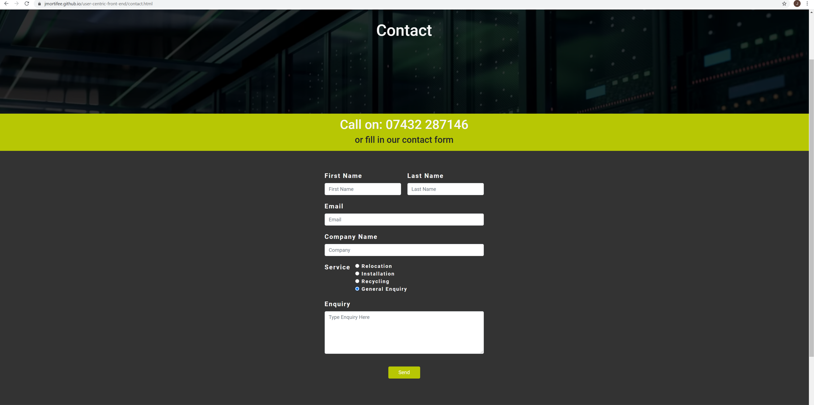

__Enquiry Modal:__ The modal will give the user more information about what to put in the enquiry text box. I gave the toggle a hover effect that fit with the colour scheme and a close button that turned red when hovered over.

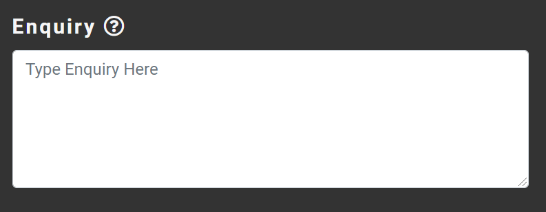
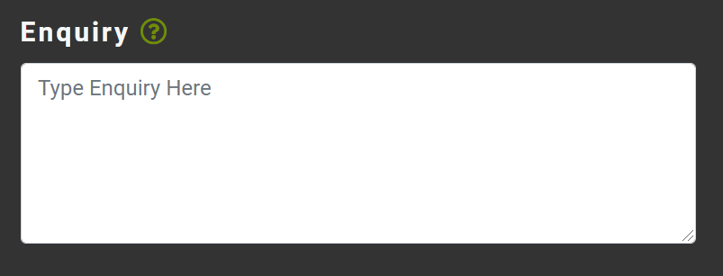
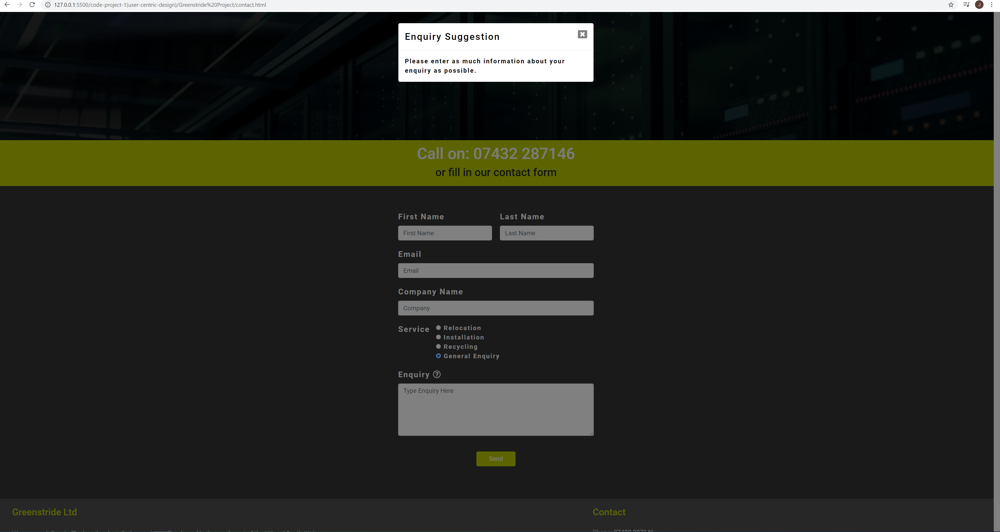
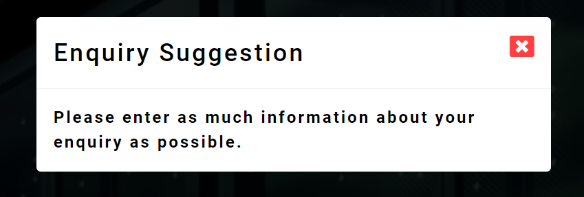

### Features Left to Implement

__Existing Customer Login:__ I do not have the knowledge to be able to implement this feature yet however I would have put a link in the navbar to easily access an existing users account.

## Technologies 
### HTML5
I Used HTML5 because it is the best language for creating static webpages to be displayed on browsers. it is the most efficient and simple to use and understand.

### CSS3
I Used CSS3 because it is the best language for styling HTML5 webpages

### Bootstrap 4
I used Bootstrap because it uses CSS3 to implement styles into HTML documents via class names. This greatly increases the speed in which a webpage can be generated without having to style every single element on the page. The CSS code can then be overwritten by a custom CSS file or inline styling.

<a href="https://getbootstrap.com/docs/3.4/" target="_blank">Here is a link to the Bootstrap4 website</a>

### Fontawesome
I used Font Awesome because it has a lot of aesthetically pleasing icons that can be easily implemented with a quick copy and paste. they can turn a webpage from being just lines of text to a more interesting minimalist style with small simplistic images to enhance the text.

<a href="https://fontawesome.com/" target="_blank">Here is a link to the Fontawesome website</a>

### Google Fonts
I used Google fonts because it is a great way to implement different fonts into an HTML document with very little effort.

<a href="https://fonts.google.com/" target="_blank">Here is a link to the Google Fonts website</a>
### Balsamiq
I used Balsamiq as it is a good-looking wireframing tool that is easy to manipulate and edit in any way you need. 

<a href="https://balsamiq.com/" target="_blank">Here is a link to the Balsamiq website</a>

## Testing 

### Code Validation
I started by running my files through the HTML and CSS validator service provided by W3C to ensure there were no coding issues. there were a few extra closing tags that had not been deleted when editing the code but other than that there were not any issues.

I then ran my site through 2, online site testers:

WAVE by https://wave.webaim.org/

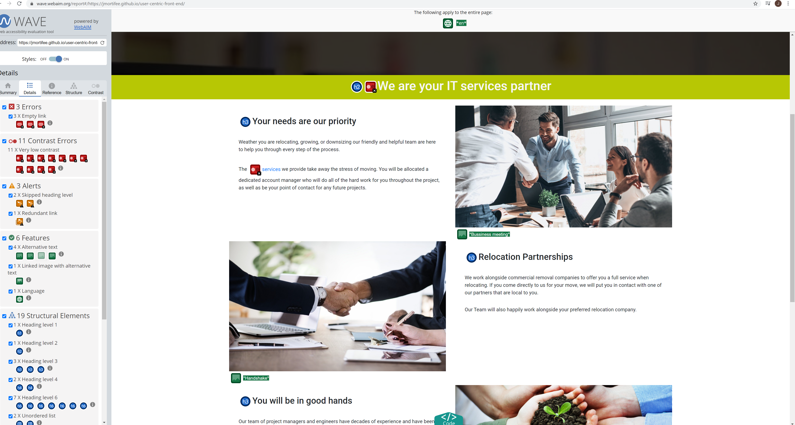

SortSite by https://www.powermapper.com/products/sortsite/

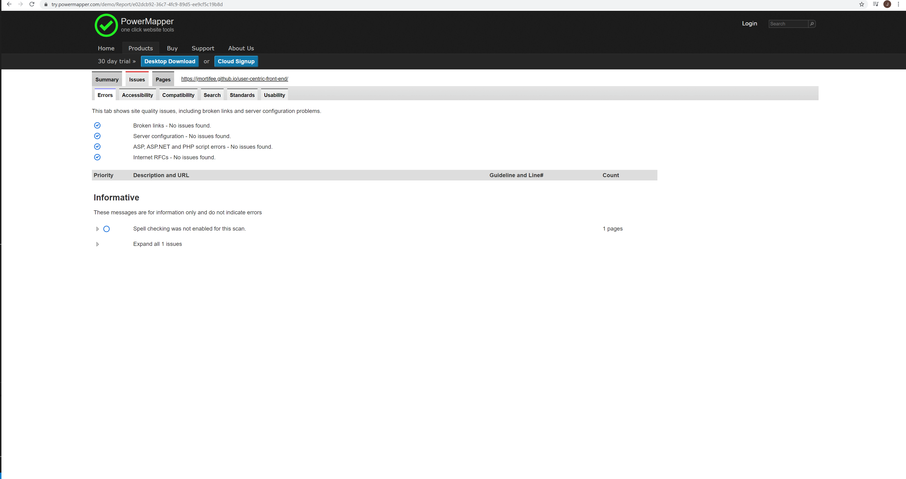

Below were the main issues:

*Text colour contrast: I Updated some of the colours to ensure that the text would be clearly visible but came to an impasse when the company colour scheme did not work well with some of the background colours. these will need to be further optimised.

*Link text too vague: I changed the text in the link so that it better describes the link location.

*Redundant link: This was because there was both a home link as well as the logo being a link to home. I kept this in because I believe the active class on the home link in the navbar provides the user with a type of "you are here" tag.

*Empty links: This issue related to the fact that the social link lead only to the general site for each social media platform. as Greenstride currently does not have any social media pages i decided this would be better than leaving the destination blank.

### user stories

__Reminder of user story 1:__ The user wants to see the services Greenstride provide and how they go about these services.
The information this user wants is easily accessible via the homepage as this provides general information about the company's practices and there is then a large button as well as a navbar link to navigate to the company's services.

__Reminder of user story 2:__ Once the user has read through the information about the service they would like to use they need to be able to get in contact.
This user can easily get to the contact page after reading the information about the services as there is a descriptive link at the bottom of each service that links to the contact page.

__Reminder of user story 3:__ The user knows or has learnt of the services and would immediately like to get in contact.
This user can easily get in contact either via the information in the footer or by navigating to the contact page via the contact tab in the navbar, or via the "get a quote" button in the jumbotron of the home page.

__Reminder of user story 4:__ The User is an existing customer and would like to see what their company has used Greestride for in the past.
I did not have the knowledge to be able to implement the code required to satisfy this user’s needs.

### Contact form:
For Validation of the contact form I used some Java Script written by <a href="https://github.com/academind">Academind</a>.
This code validated the input content required in each input.

these are the results of the test:

*First, I sent the form with none of the fields filled:

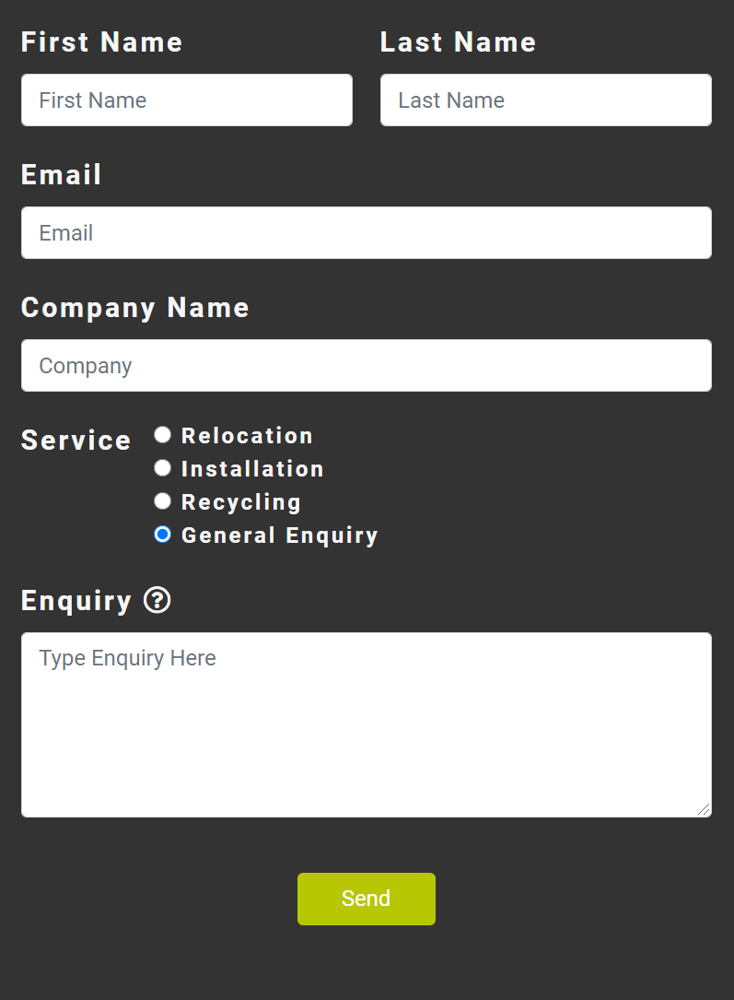

*This was the result:

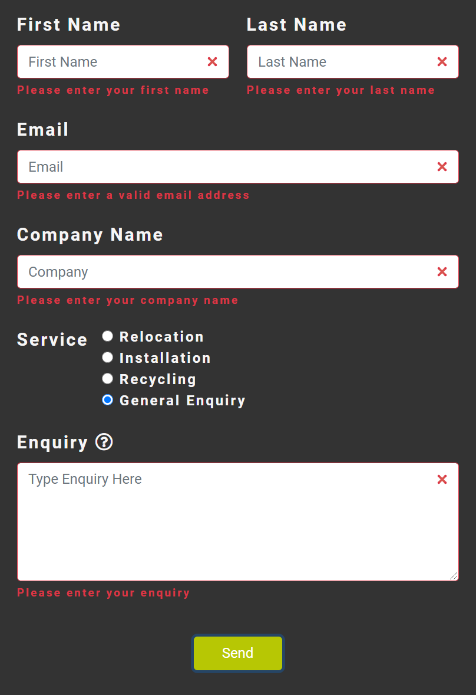

*Then, I sent the form with some of the fields filled:

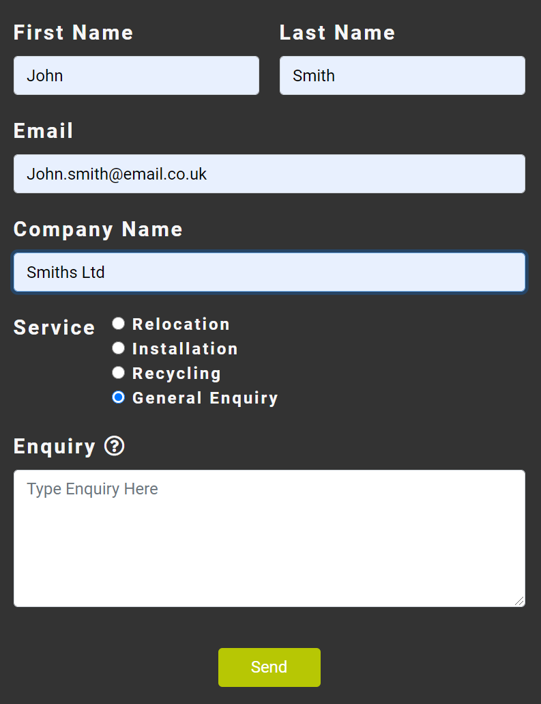

*This was the result:

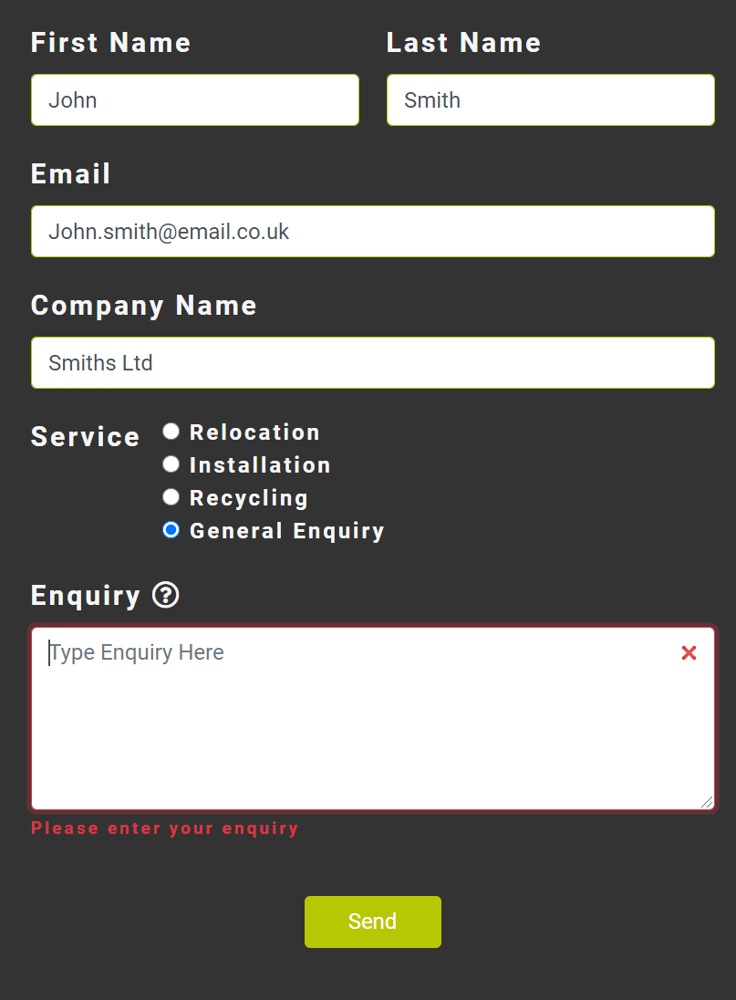

I believe the feedback gives the user enough information to fill in any fields that they missed the first time.

### Responsivity
Because I used Bootstraps built in, mobile first, design. The website works well on varying screen sizes. I used several class selectors within the HTML so that bootstraps styling could work its magic.

Mobile layout:

  

Large screen size:

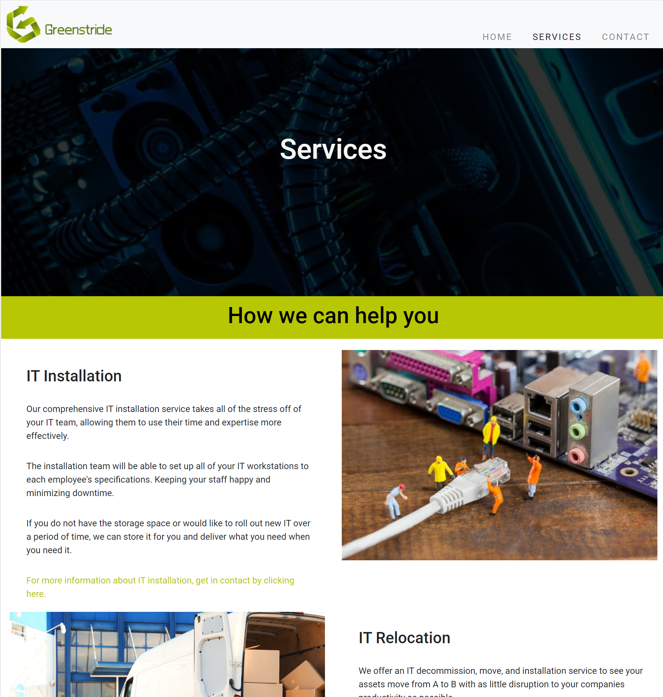
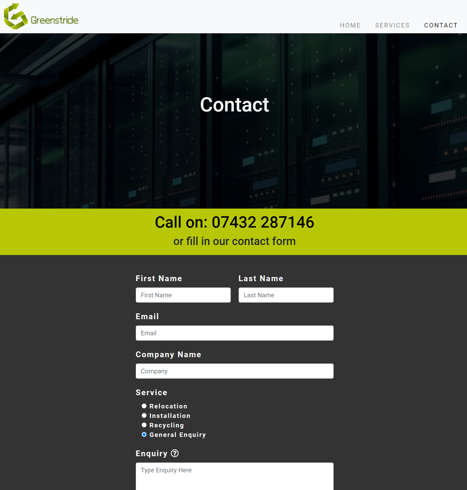

X-large screen size:

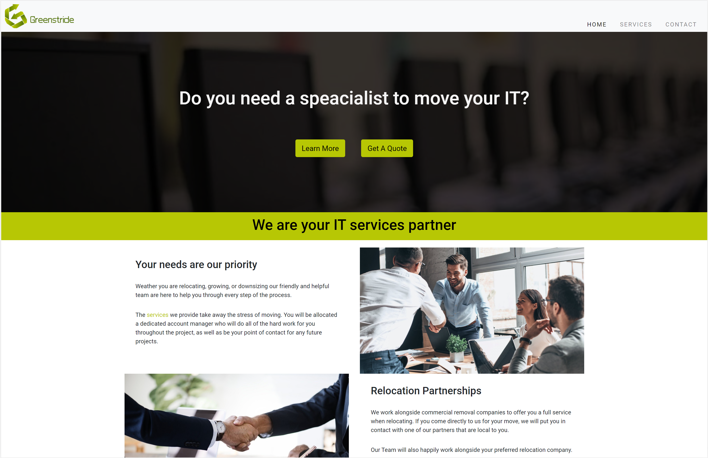
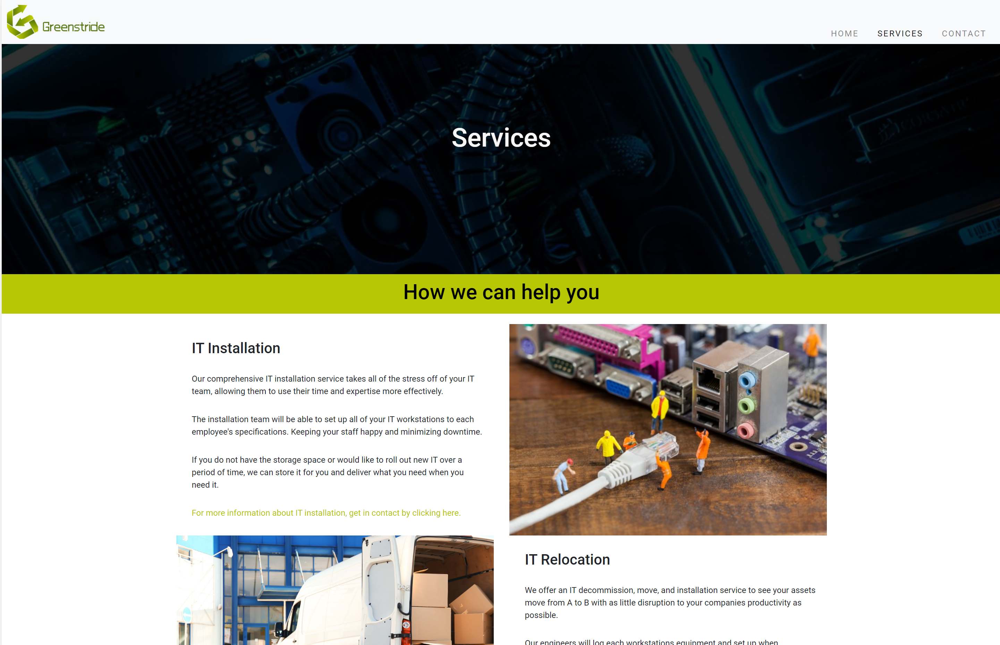
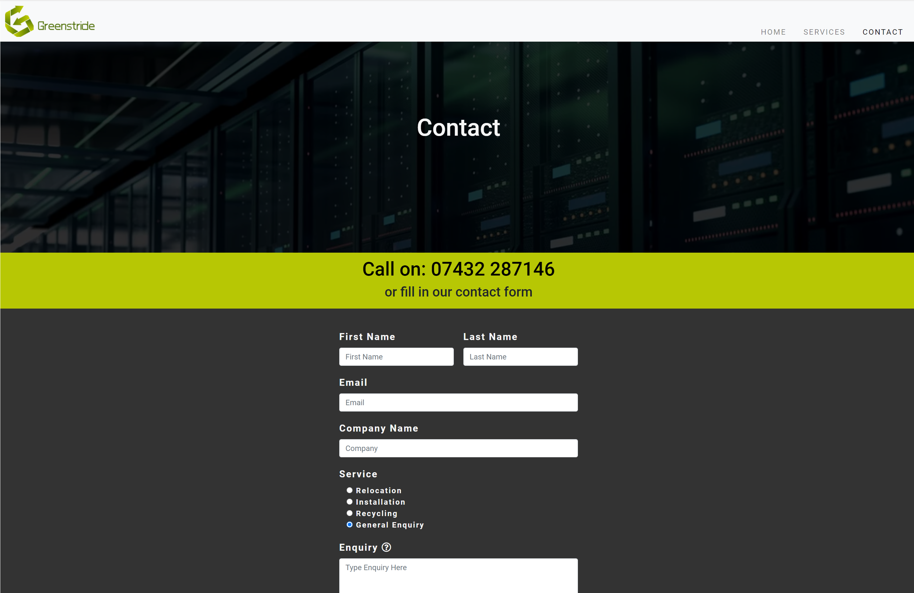

## Deployment 

I used Github pages to deploy my site. This tool makes it very easy to deploy your site.
Once all of my files were in there final deployment state, I went to the settings tab of the Github Repo I wanted to deploy.

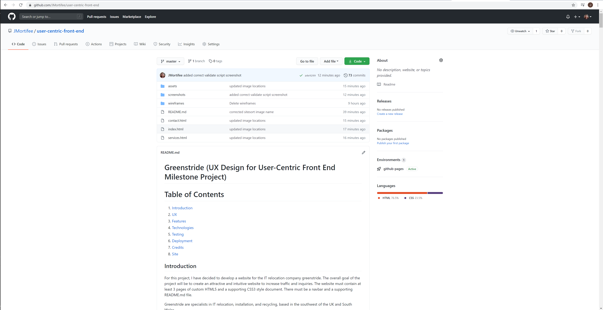

I then scrolled down to the Github pages section where I then selected the branch from which to deploy (master):

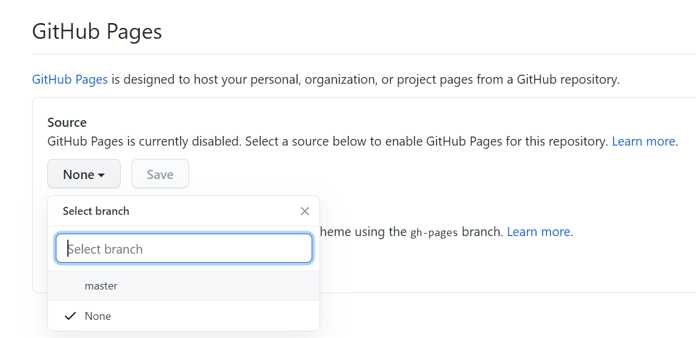

Within several minutes the site was live at this address: https://jmortifee.github.io/user-centric-front-end/index.html

## Credits 

### Content
validation script in contact.html
__Author:__ https://github.com/academind
__Source code:__ https://github.com/academind/bootstrap4-introduction/tree/02-grid

#### Media

##### Home
home-hero: https://i.ytimg.com/vi/5Y1GpL768Sk/maxresdefault.jpg

home-mobile-hero: https://ceeds.ie/wp-content/uploads/2020/08/CEEDS-Centre-of-Digital-Excellence-Dublin.jpg

home-img-1: https://www.incimages.com/uploaded_files/image/1024x576/getty_951514270_400405.jpg

home-img-2: https://chacc.co.uk/wp-content/uploads/2019/07/Partnership.jpg

home-img-3: https://www.scout.org/sites/default/files/styles/770x/public/content_images/sustainabilityenvironment_4.jpg?itok=E41l8Aky

##### Services

service-hero: https://westraycomputers.co.uk/wp-content/uploads/2019/11/hd-wallpapers-computer-1.jpg

service-img-1: https://image.freepik.com/free-photo/miniature-engineer-worker-plug-lan-cable-computer_1252-838.jpg

services-img-2: https://www.expertmanandvan.co.uk/wp-content/uploads/2020/02/Moving-Office1200px.jpg

services-img-3: https://gptwaste.com/wp-content/uploads/2019/07/WEEE.jpg

##### Contact

contact-hero: https://img1.wsimg.com/isteam/stock/6yOme1a/:/rs=h:1000,cg:true,m

contact-mobile-hero: https://www.dqindia.com/wp-content/uploads/2016/02/datacenter.jpg

Click <a href="https://jmortifee.github.io/user-centric-front-end/" target="_blank">here</a> to view the site.
